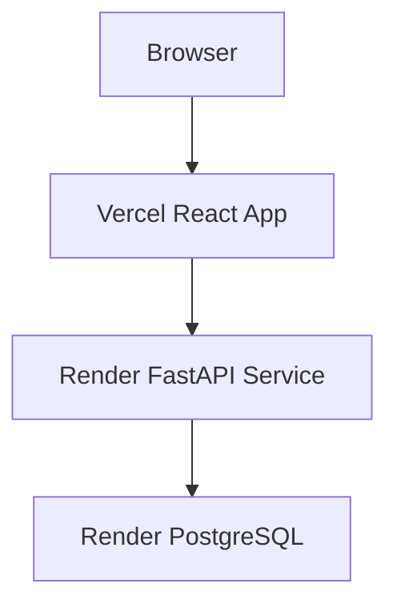

# Architecture

InventoHub is split into a REST API backend and a browser frontend.

## Backend

FastAPI exposes `/api/v1` routes for products, customers, orders, dashboard analytics, and health checks. SQLAlchemy models define products, customers, orders, and order items. Alembic owns schema migration history.

The order service wraps order creation in a single transaction:

1. Validate the customer exists.
2. Validate every product exists.
3. Validate requested quantities are available.
4. Deduct inventory.
5. Create the order and order items.
6. Commit or roll back as one unit.

SQLite is the default local fallback. PostgreSQL is the production target.

## Frontend

React 19 and Vite power the client app. React Query handles API state, React Hook Form handles forms, Recharts renders dashboard charts, and Tailwind CSS provides styling.

Main screens:

- Dashboard analytics
- Product CRUD and stock monitoring
- Customer CRUD
- Order creation, history, and details

## Deployment Shape

